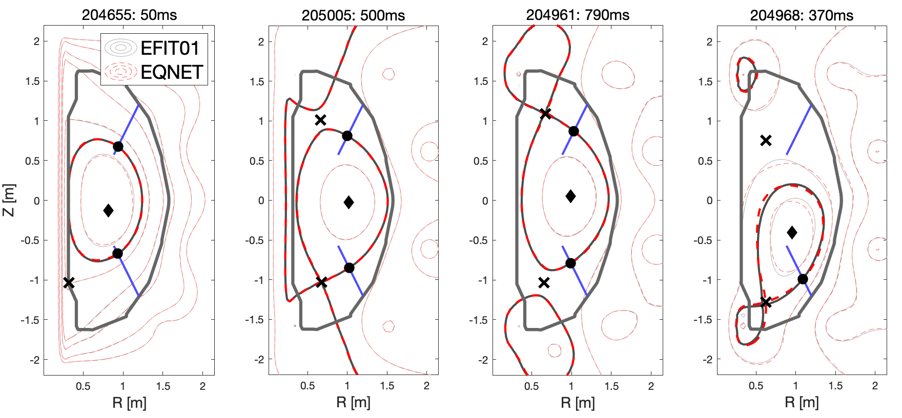
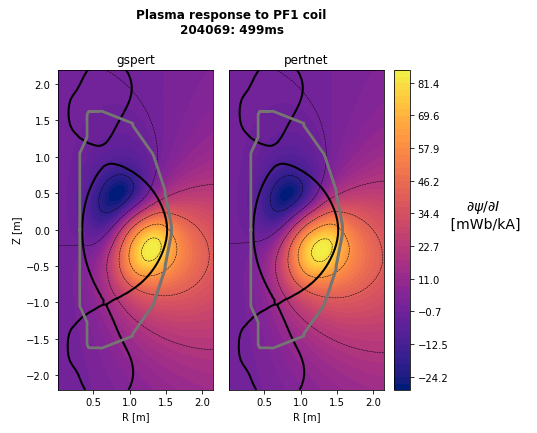
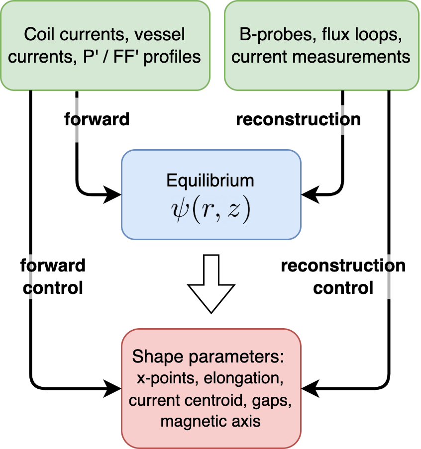

# Overview

This repo accompanies the [paper](https://control.princeton.edu/wp-content/uploads/sites/418/2022/05/neural_net_modeling_of_equilibria_in_nstxu-1.pdf) "Neural net modeling of equilibria in NSTX-U". If you use this code for any publications please cite this paper--thanks! 

The repo is divided into 2 parts: Eqnet is a neural net (NN) that obtains the plasma equilibrium given various sets of inputs, such as coil currents and magnetic diagnostics and is trained on EFIT01 reconstructions. Pertnet is a neural net that obtains the nonrigid plasma response and is trained on the Gspert code. 


Eqnet can predict the equilibrium flux map which looks like this: 

<p align="center">

</p>


Pertnet predicts the nonrigid plasma response which looks like this: 

<p align="center">

</p>


This is the public access repo version and the best starting point for seeing the code. If you have access to PPPL computer systems, additional analysis code (albeit less-well documented) is located at https://git.pppl.gov/jwai/nstxu-nns and raw data is on the PPPL portal cluster at `/p/nstxusr/nstx-users/jwai/nstxu-nns/data/`. 

Email for any questions: josiah.wai@princeton.edu


# Package and path prerequisites

#### 1. Use a terminal to set the environment variable `NN_ROOT` to reflect the install location of this repo. This depends on your shell environment, for example with CSH or BASH this can be done as: 

CSH:
`setenv NN_ROOT <install location> `

BASH:
`export NN_ROOT=<install location>`

#### 2. Install the necessary supporting packages. This step may only be necessary if you don't already have pytorch installed. 

A requirements.txt file is provided in the NN_ROOT directory. The supporting packages can be installed with the command `pip install -r requirements.txt`, however this may install many more packages than necessary. 

The following install procedure might be better to try first, and was tested to work on the PPPL portal cluster. This creates and activates a conda environment named `torch-env`

```
conda create --name torch-env pytorch torchvision matplotlib scikit-learn scipy   
conda activate torch-env  
pip install easydict mat73
```  

# Eqnet: getting started

The main version of the code is located in the `eqnet/net/` directory. A working example is also provided in the `examples/example001/`. To run this example:

*  `cd ~/eqnet/examples/example001`
*  Edit the file `define_input_args.py` as desired. See file comments. 
    * All the hyperparameters and job settings such as the number of hidden layers are defined in this file. 
    * Setting the variable **nn_mode** to one of  "forward", "forward-control", "reconstruction", "reconstruction-control" will configure the inputs and outputs of the neural net. For example, the forward mode uses internal profiles, whereas the reconstruction mode uses diagnostics. The inputs/outputs are summarized in this figure
    
<p align="center">
  
</p>

* Run the file: `python define_input_args.py`. This creates a settings file `args.json` which Eqnet reads from. 
* Run Eqnet: `python eqnet_batch.py`
* Evaluate results. Some notes:
    * After the NN is trained various figures and outputs will be saved, in the location defined by the **save_results_dir** variable from `define_input_args.py`. 
    * If **save_model** was set to true, subsequent runs can use this pretrained model, if **use_pretrained_model** and **load_results_dir** are configured for it. 
    * The `out.mat` file contains the actual data of the NN predictions


# Pertnet: getting started

The main version of the code is located in the `pertnet/net/` directory. Some working examples are provided in the `examples/control/` and `examples/flux-mode`. To run either example:

*  `cd <example_directory>`
* Edit the file `define_input_args.py` as desired. See file comments. 
* Run the file: `python define_input_args.py`. This creates a settings file `args.json` which Pertnet reads from. 
* Run Pertnet: `python pertnet_batch.py`
* Evaluate results. Some notes:
    * After the NN is trained various figures and outputs will be saved, in the location defined by the **save_results_dir** variable from `define_input_args.py`. 
    * If **save_model** was set to true, subsequent runs can use this pretrained model, if **use_pretrained_model** and **load_results_dir** are configured for it. 
    * The `out.mat` file contains the actual data of the NN predictions

# Additional notes

### Data

Due to size restrictions, the data included with this repo is only the PCA projection of the data and not the raw data. User should be aware that any results, figures, etc generated here compare the NN-predicted values vs the PCA projection of the ground truth (EFIT01, Gspert) data. Comparison of the NN prediction vs raw EFIT data is available on PPPL portal cluster.  (This distinction only matters for non-scalar signals). 

The paper describes a PCA ''merging'' procedure that was used to identify PCA components and balance the representation of equilibrium samples from rampup, flattop, and rampdown times. The code that performs this task is available in `pertnet/data/preprocess_pertdata3.py` and `eqnet/data/preprocess_eqdata3.py`, however will not run without access to the raw data on Portal. 


### Analysis

A handful of jupyter notebooks / scripts / matlab codes that were used in analysis are provided in the `eqnet/eval` and `pertnet/eval` directories. These are provided as-is for reference, but may not run properly without additional effort from the user. 


